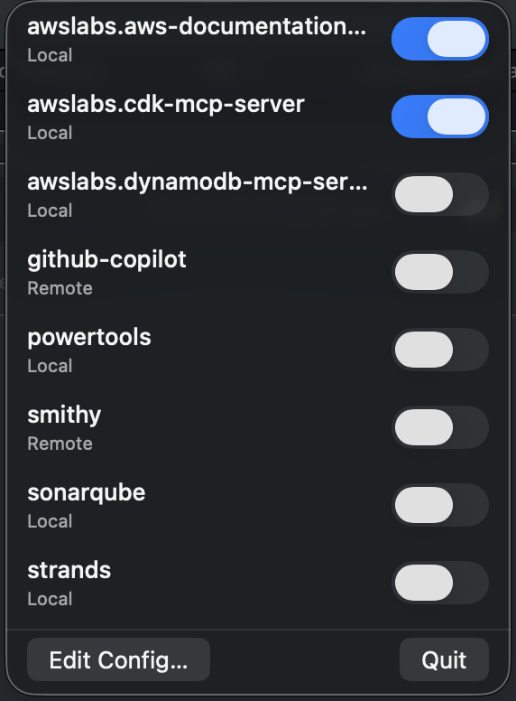

# Kiro MCP Manager

A lightweight macOS menu bar app for managing your [Kiro CLI](https://kiro.dev/docs/cli/) MCP server configuration and settings.

No more editing JSON by hand or trying to remember which servers are enabled. Just click the **K** in your menu bar.


## Why?

Kiro CLI uses MCP (Model Context Protocol) servers to extend its capabilities and stores settings in JSON files you'd normally edit by hand.

This app puts that config in your menu bar so you can:

- **Switch between MCP and Settings tabs** with a single click
- **See all your MCP servers** at a glance
- **Check which are enabled or disabled**
- **See whether each server is local or remote**
- **Toggle servers on and off** with a single click
- **Disable specific tools** without disabling the whole server
- **Manage Kiro CLI settings** with toggles and text fields
- **Open config files** in your default editor when you need to make deeper changes

<p align="center">
  
</p>

## Important: Kiro CLI doesn't hot-reload

Kiro CLI loads MCP servers when a session starts. If you toggle a server while a session is running, the change won't take effect until the next session.

The quickest way to pick up changes:

```bash
# Exit your current session, then resume it
kiro-cli chat --resume
```

## Installation

1. Clone this repo
2. Open `KiroMcpManager/KiroMcpManager.xcodeproj` in Xcode
3. Build and run (`Cmd+R`)
4. Look for the **K** in your menu bar

### First launch

The app runs in a sandbox for security. On first launch it will ask you to select your `mcp.json` file:

1. Click the **K** in the menu bar
2. Click **Select mcp.json…**
3. Navigate to `~/.kiro/settings/` and select the **folder**

This grants the app read/write access to that directory. The permission is remembered across launches.

> **Tip:** Press `Cmd+Shift+.` in the file picker to show hidden files like `.kiro`.

## Usage

Click the **K** in your menu bar to open the app. Use the **MCP** and **Settings** tabs to switch between views.

### MCP Tab

- Each server shows its **name**, **type** (Local or Remote), and an **on/off toggle**
- Flip a toggle to set `"disabled": true` or `"disabled": false` in the config
- Click the **chevron** next to a server to expand and manage individual tools
- Click **Edit Config…** to open `mcp.json` in your default editor

### Settings Tab

- Settings are grouped by category (Privacy, Chat, Features, Knowledge, API, MCP)
- Click a category to expand and see its settings
- Toggle switches for boolean settings, text fields for strings and numbers
- Hover over a setting label to see a tooltip description
- Click **Edit Settings…** to open `cli.json` in your default editor
- Click **Docs** to open the [Kiro CLI settings documentation](https://kiro.dev/docs/cli/reference/settings/)

The config refreshes every time you open the menu.

### Disabling specific tools

Sometimes you want to keep an MCP server enabled but block certain tools. For example, when Kiro CLI asks to use a tool you'd rather it didn't:

1. Click the **chevron** next to the server name to expand it
2. Type the tool name in the text field (exactly as shown in the CLI prompt)
3. Click **Add**

The tool is now in the `disabledTools` array and won't be offered to the agent.

To re-enable a tool, expand the server and click **Enable** next to the tool name.

> **Tip:** Run `/mcp` in a Kiro CLI session to see all available tools for each server.

## How it works

- Reads and writes `~/.kiro/settings/mcp.json` (the [global Kiro MCP config](https://kiro.dev/docs/cli/mcp/configuration/))
- Reads and writes `~/.kiro/settings/cli.json` (the [Kiro CLI settings](https://kiro.dev/docs/cli/reference/settings/))
- A server is **Local** if it has a `command` field, **Remote** if it has a `url` field
- Toggling a server sets the `disabled` field to `true` or `false` — all other config is preserved
- Uses macOS security-scoped bookmarks so the sandboxed app only has access to the folder you granted

## Requirements

- macOS 26.1+
- Xcode 26.1+

## License

MIT
