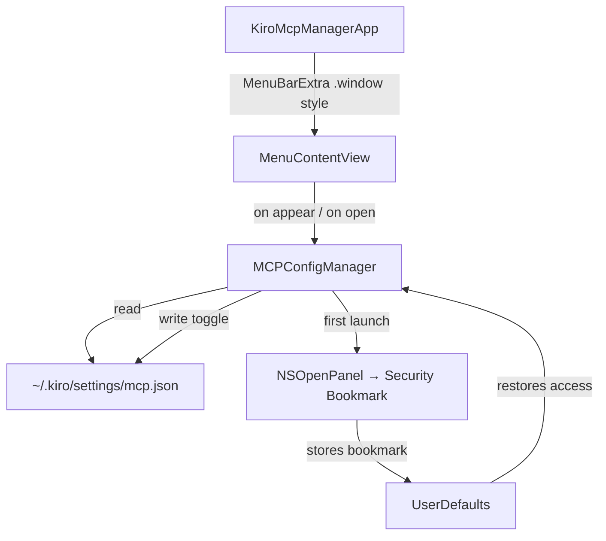

# Kiro MCP Manager — Implementation Spec

## Problem Statement
Build a macOS menu bar-only app that lets you visualize and manage your Kiro CLI MCP server configuration (`~/.kiro/settings/mcp.json`). The app shows each server's name, type (local/remote), and enabled/disabled status, and lets you toggle servers on/off.

## Requirements
- Menu bar-only app (no dock icon, no main window) showing "K" in the menu bar
- Reads `~/.kiro/settings/mcp.json` fresh each time the menu is opened
- Displays each server with: name, type (local = has `command`, remote = has `url`), enabled/disabled
- Toggle sets `"disabled": true` or `"disabled": false` (never removes the key)
- App sandbox enabled; uses security-scoped bookmark for file access
- On first launch, shows `NSOpenPanel` to grant access to the mcp.json file
- Menu stays open after toggling a server
- If config file doesn't exist or can't be read, shows "No MCP config found" message

## Background
- Kiro MCP config is JSON with a top-level `"mcpServers"` object. Each key is a server name. Local servers have `"command"` + `"args"`, remote servers have `"url"`. Both can have `"disabled": bool`.
- The existing Xcode project is a fresh SwiftUI app (macOS 26.1, Swift 5) with file-system-synchronized groups. We need to convert it from a windowed app to a menu bar app.
- SwiftUI's `MenuBarExtra` with `.window` style renders a popover-like panel that stays open, which is the simplest path for keeping the menu open after toggling.

## Architecture

Key components:
1. `McpServer` — model struct for a single server (Codable)
2. `McpConfig` — model struct for the top-level config (Codable)
3. `MCPConfigManager` — ObservableObject that handles reading/writing the JSON file, bookmark storage/resolution
4. `MenuContentView` — SwiftUI view rendered inside the MenuBarExtra panel
5. `KiroMcpManagerApp` — app entry point with `MenuBarExtra` using `.window` style, no dock icon

## Task Breakdown

### Task 1: Define the MCP config data models
- **Objective:** Create `McpServer` and `McpConfig` Codable structs that can round-trip the Kiro MCP JSON without losing unknown fields.
- **Implementation:** `McpServer` needs to preserve arbitrary keys (like `command`, `args`, `url`, `headers`, `env`, etc.) while exposing `disabled` as a mutable property. Use a custom Codable approach: decode into a `[String: AnyCodableValue]` dictionary, with typed accessors for `disabled`, `command`, and `url`. `McpConfig` wraps `"mcpServers": [String: McpServer]`.

### Task 2: Build the MCPConfigManager with file read/write and bookmark handling
- **Objective:** Create an `ObservableObject` class that manages security-scoped bookmark storage, file reading, and file writing.
- **Implementation:**
  - `requestFileAccess()` — presents a standalone `NSOpenPanel` pre-navigated to `~/.kiro/settings/`, filtered to `.json`. On selection, creates a security-scoped bookmark and stores it in `UserDefaults`.
  - `loadConfig()` — resolves the bookmark, starts security-scoped access, reads and decodes the JSON, stops access. Publishes `[McpServer]` and any error state.
  - `toggleServer(name:)` — loads config, flips the `disabled` field for the named server, writes back the JSON (preserving formatting with `.prettyPrinted` + `.sortedKeys`).
  - `hasBookmark` computed property to check if access has been granted.

### Task 3: Convert the app to a menu bar-only app with MenuBarExtra
- **Objective:** Replace the windowed app with a menu bar-only app showing "K" in the menu bar.
- **Implementation:**
  - In `KiroMcpManagerApp`, replace `WindowGroup` with `MenuBarExtra { ... } label: { Text("K") }` using `.menuBarExtraStyle(.window)`.
  - Add `LSUIElement = YES` to Info.plist (via build settings: `INFOPLIST_KEY_LSUIElement = YES`) to hide the dock icon.

### Task 4: Build the MenuContentView and wire everything together
- **Objective:** Create the SwiftUI view that shows inside the menu bar panel, listing servers with their status and toggle controls.
- **Implementation:**
  - `MenuContentView` takes `MCPConfigManager` as an `@ObservedObject`.
  - On appear, check `hasBookmark` — if not, call `requestFileAccess()`. Then call `loadConfig()`.
  - If no config / error: show "No MCP config found — configure servers in ~/.kiro/settings/mcp.json".
  - Otherwise: show a `VStack` of server rows. Each row shows:
    - Server name (bold)
    - Type badge: "Local" or "Remote" (based on whether `command` or `url` is present)
    - A `Toggle` bound to the enabled state (inverted from `disabled`)
  - Toggle action calls `toggleServer(name:)` then `loadConfig()` to refresh.
  - Add a "Quit" button at the bottom.
  - Wire `MenuContentView` into the `MenuBarExtra` in `KiroMcpManagerApp`.
